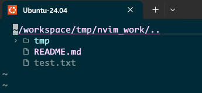
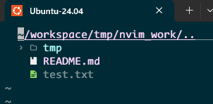
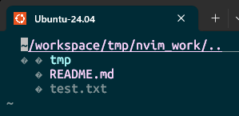

# Neovim の最低限セットアップ

前提:

- Windows 11
- WSL2 (Ubuntu)
- Windows Terminal または VSCode

## 概要

WSL 上で `neovim` をインストールし、最低限の `init.lua` と `nvim-tree` を設定する。

ファイルアイコンを表示したい場合は、`nvim-web-devicons` と Windows 側の Nerd Font 設定も必要になる。

## 手順

### 1. WSL 側で Neovim をインストールする

```bash
sudo apt update
sudo apt install -y neovim
```

### 2. 起動確認をする

```bash
nvim -v
```

### 3. 設定ファイル用のディレクトリを作る

```bash
mkdir -p ~/.config/nvim
```

### 4. `init.lua` を作成する

Neovim または VSCode で `~/.config/nvim/init.lua` を開く。

```bash
nvim ~/.config/nvim/init.lua
# or
code ~/.config/nvim/init.lua
```

最低限の設定例:

```lua
-- 行番号を表示
vim.opt.number = true

-- マウス操作を有効化
vim.opt.mouse = "a"

-- システムクリップボードを使う
vim.opt.clipboard = "unnamedplus"

-- Visual mode で Ctrl+C でもコピーできるようにする
vim.keymap.set("v", "<C-c>", '"+y')
```

### 5. `nvim-tree` をインストールする

まずプラグイン配置先を作る。

```bash
mkdir -p ~/.local/share/nvim/site/pack/plugins/start
```

その後、`nvim-tree` とアイコン表示用のプラグインを clone する。

```bash
git clone https://github.com/nvim-tree/nvim-tree.lua \
  ~/.local/share/nvim/site/pack/plugins/start/nvim-tree.lua

git clone https://github.com/nvim-tree/nvim-web-devicons \
  ~/.local/share/nvim/site/pack/plugins/start/nvim-web-devicons
```

### 6. `init.lua` に `nvim-tree` の設定を追加する

`init.lua` の末尾に次を追加する。

```lua
-- nvim-tree setup
require("nvim-tree").setup()
```

### 7. 動作確認をする

```bash
nvim .
```

Neovim 起動後に次を実行して、ファイルツリーが開けば設定完了。

```vim
:NvimTreeToggle
```

## 補足

### アイコン表示の成功例

| 構成 | 表示例 |
| - | - |
| `nvim-tree` のみ |  |
| `nvim-tree` + `nvim-web-devicons` + Nerd Font |  |

### アイコンが崩れる場合

`nvim-web-devicons` を入れていても、Windows 側で Nerd Font を使っていないと、アイコンが四角や文字化けのように見えることがある。

例: `nvim-web-devicons` を入れていても、WSL のデフォルトに近い `Ubuntu Mono` のままだと次のように崩れることがある。



### 1. Windows 側に Nerd Font を入れる

ダウンロード先:

https://www.nerdfonts.com/font-downloads

例:

- Hack Nerd Font
- JetBrainsMono Nerd Font

### 2. ターミナルのフォントを変更する

Windows Terminal を使っている場合は、対象プロファイルのフォントを Nerd Font に変更する。

VSCode のターミナルを使っている場合は、`terminal.integrated.fontFamily` に Nerd Font を設定する。

### 3. 反映を確認する

ターミナルを開き直して `nvim .` を実行し、`NvimTreeToggle` でアイコン表示を確認する。

## 補足メモ

- `vim.opt.clipboard = "unnamedplus"` が効かない場合は、`nvim` 側の clipboard provider が足りないことがある。その場合は `:checkhealth` で確認する。
- いったん最小構成で入れて、必要になってからキーマップや補完プラグインを追加すると管理しやすい。
