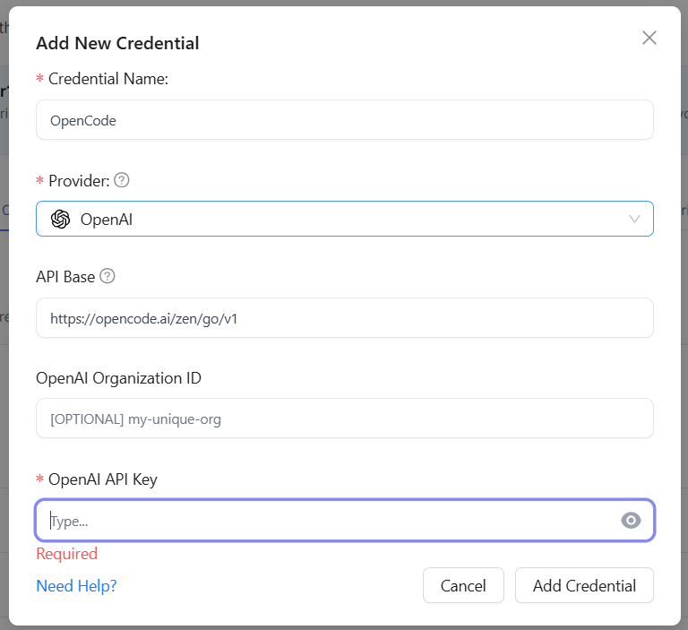
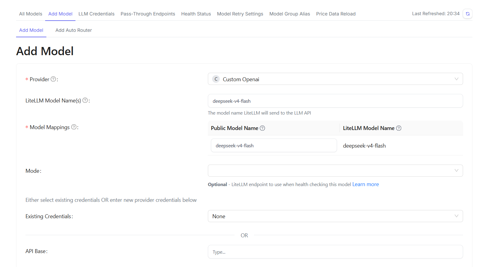
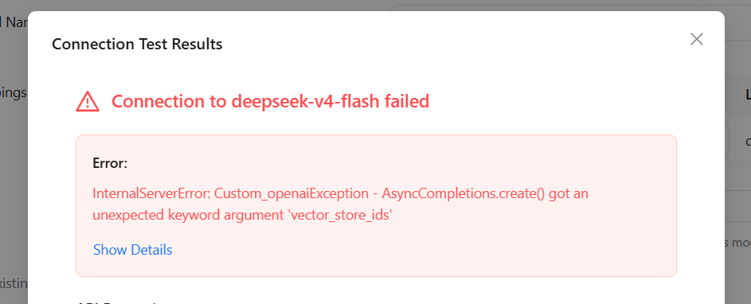
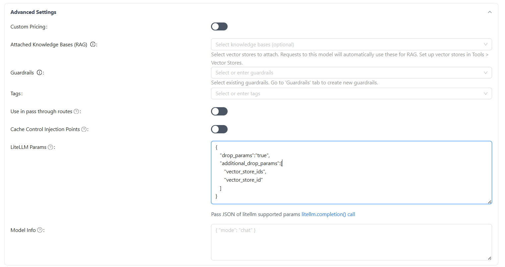
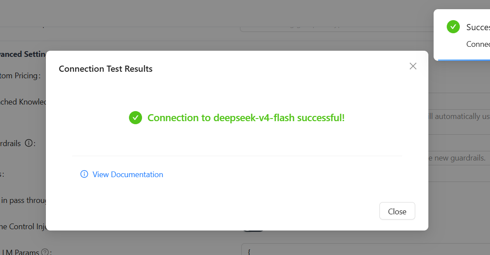

# OpenCode Go のモデルを LiteLLM に登録する

Last reviewed: 2026-06-15

## 概要

OpenCode Go のサブスクリプションで使えるモデルを LiteLLM に登録する手順。

Claude Code や Codex CLI など、LiteLLM 経由でモデルを呼び出せるツールから OpenCode Go のモデルを使いたい場合に設定する。

## 前提

- OpenCode Go のサブスクリプションと API キーを取得済み
- LiteLLM の管理画面にアクセスできる
- LiteLLM にモデルを追加できる権限がある

## OpenCode Go のエンドポイント

OpenCode Go の API エンドポイントは公式ドキュメントで公開されている。

- [OpenCode Go - エンドポイント](https://opencode.ai/docs/ja/go/#%E3%82%A8%E3%83%B3%E3%83%89%E3%83%9D%E3%82%A4%E3%83%B3%E3%83%88)

2026-06-15 時点のモデル一覧:

| Model | Model ID | Endpoint | AI SDK Package |
| --- | --- | --- | --- |
| GLM-5.1 | `glm-5.1` | `https://opencode.ai/zen/go/v1/chat/completions` | `@ai-sdk/openai-compatible` |
| GLM-5 | `glm-5` | `https://opencode.ai/zen/go/v1/chat/completions` | `@ai-sdk/openai-compatible` |
| Kimi K2.7 Code | `kimi-k2.7-code` | `https://opencode.ai/zen/go/v1/chat/completions` | `@ai-sdk/openai-compatible` |
| Kimi K2.6 | `kimi-k2.6` | `https://opencode.ai/zen/go/v1/chat/completions` | `@ai-sdk/openai-compatible` |
| DeepSeek V4 Pro | `deepseek-v4-pro` | `https://opencode.ai/zen/go/v1/chat/completions` | `@ai-sdk/openai-compatible` |
| DeepSeek V4 Flash | `deepseek-v4-flash` | `https://opencode.ai/zen/go/v1/chat/completions` | `@ai-sdk/openai-compatible` |
| MiMo-V2.5 | `mimo-v2.5` | `https://opencode.ai/zen/go/v1/chat/completions` | `@ai-sdk/openai-compatible` |
| MiMo-V2.5-Pro | `mimo-v2.5-pro` | `https://opencode.ai/zen/go/v1/chat/completions` | `@ai-sdk/openai-compatible` |
| MiniMax M3 | `minimax-m3` | `https://opencode.ai/zen/go/v1/messages` | `@ai-sdk/anthropic` |
| MiniMax M2.7 | `minimax-m2.7` | `https://opencode.ai/zen/go/v1/messages` | `@ai-sdk/anthropic` |
| MiniMax M2.5 | `minimax-m2.5` | `https://opencode.ai/zen/go/v1/messages` | `@ai-sdk/anthropic` |
| Qwen3.7 Max | `qwen3.7-max` | `https://opencode.ai/zen/go/v1/messages` | `@ai-sdk/anthropic` |
| Qwen3.7 Plus | `qwen3.7-plus` | `https://opencode.ai/zen/go/v1/messages` | `@ai-sdk/anthropic` |
| Qwen3.6 Plus | `qwen3.6-plus` | `https://opencode.ai/zen/go/v1/messages` | `@ai-sdk/anthropic` |

> [!NOTE]
> 公式ページの表と、実際に `https://opencode.ai/zen/go/v1/models` から返る Model ID がずれる場合がある。LiteLLM の Model Name には、登録時点で実際に使える Model ID を指定する。

OpenCode の設定で使う model id は `opencode-go/<model-id>` 形式になる。

たとえば Kimi K2.7 Code の場合は、OpenCode 側の設定では `opencode-go/kimi-k2.7-code` を使う。

## LiteLLM でのモデル登録手順

### 1. OpenCode 用の Credential を追加する

LiteLLM の管理画面で Credential を追加する。

設定値:

| 項目 | 値 |
| --- | --- |
| Credential Name | `OpenCode` など、分かりやすい名前 |
| Provider | `OpenAI` |
| API Base | `https://opencode.ai/zen/go/v1` |
| OpenAI Organization ID | 未入力 |
| OpenAI API Key | OpenCode の API Key |



### 2. Model を追加する

モデル追加画面で、先ほど作成した Credential を使って OpenCode Go のモデルを登録する。

設定値:

| 項目 | 値 |
| --- | --- |
| Provider | `Custom Openai` |
| LiteLLM Model Name(s) | 登録したい `Model ID` |
| Existing Credentials | OpenCode 用に作成した Credential |

例として `deepseek-v4-flash` を登録する場合は、LiteLLM Model Name に `deepseek-v4-flash` を指定する。

公式表で `/v1/messages` / `@ai-sdk/anthropic` とされているモデルも、LiteLLM 管理画面ではこの設定で `Test Connect` し、成功を確認してから追加する。



### 3. `vector_store_ids` エラーが出る場合はパラメータを落とす

`Test Connect` を実行すると、モデルによっては `vector_store_ids` に関するエラーが出ることがある。



この場合は `Advanced Settings` を展開し、`LiteLLM Params` に以下を設定する。

```json
{
  "drop_params": "true",
  "additional_drop_params": [
    "vector_store_ids",
    "vector_store_id"
  ]
}
```



### 4. 接続確認してモデルを追加する

もう一度 `Test Connect` を実行し、成功することを確認する。



接続確認が成功したら `Add Model` を押して登録を完了する。

## 補足

- `kimi-k2.7-code` ではエラーが出ず、`deepseek-v4-flash` などでは `vector_store_ids` エラーが出る場合がある。
- 同じエラーが出るモデルは、上記の `drop_params` 設定を追加してから接続確認する。
- OpenCode Go のモデル一覧は変更される可能性があるため、追加時は公式ドキュメントも確認する。
