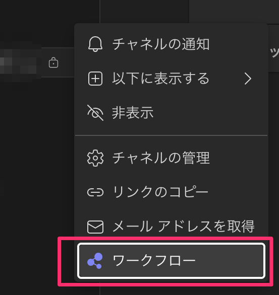
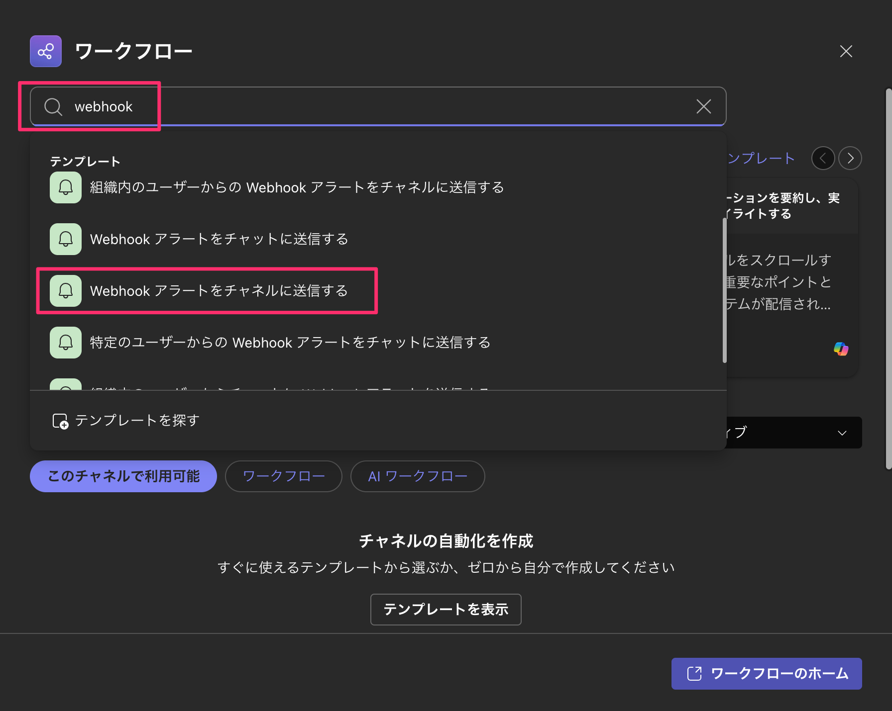
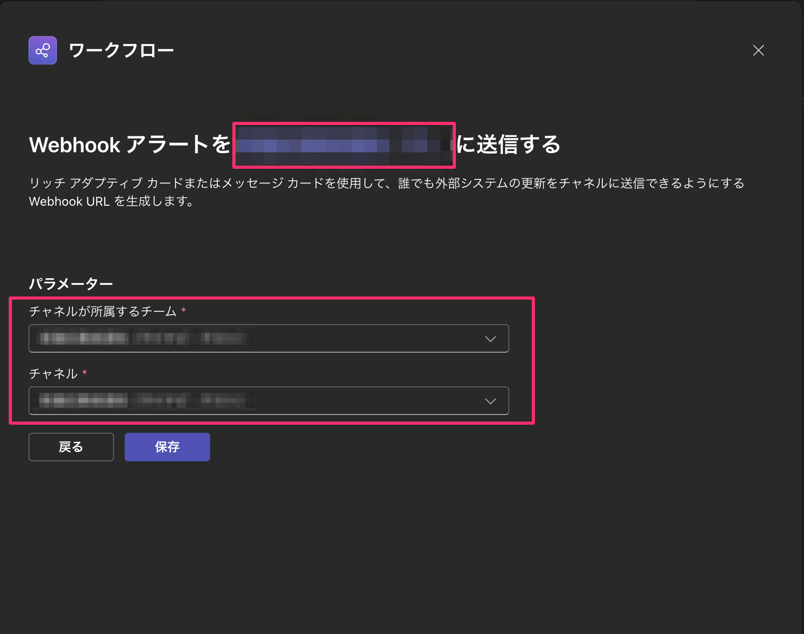
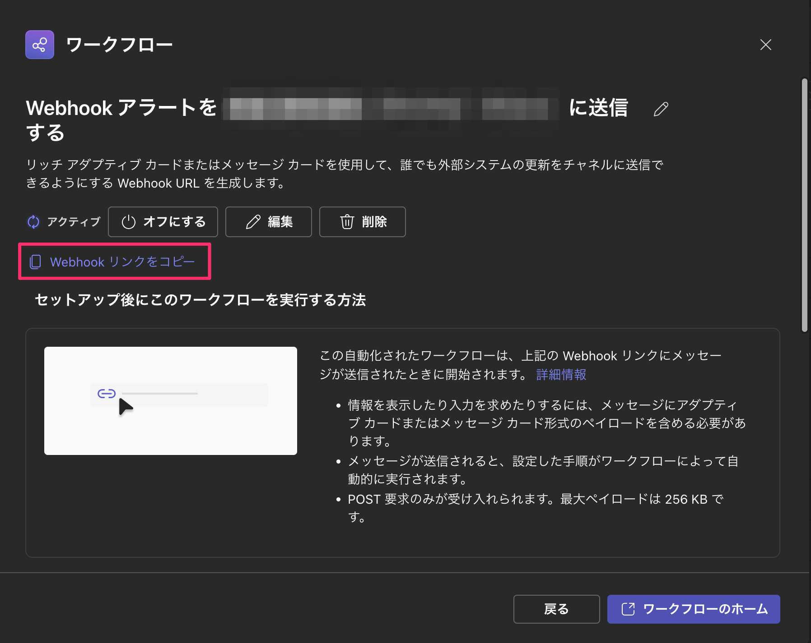

# Teams のワークフローから Webhook 通知を設定する

Teams のチャネルに対して、ワークフロー経由で Webhook 通知を受け取る設定手順。

前提:

- 通知先にしたい Teams のチャネルを開けること

## 手順

### 1. 対象チャネルからワークフローを開く

通知を送りたいチャネルを右クリックし、`ワークフロー` を選択する。



### 2. Webhook 用のテンプレートを選ぶ

検索欄に `webhook` と入力し、候補から `Webhook アラートをチャネルに送信する` を選択する。



### 3. 通知先を確認して保存する

確認画面で通知先のチャネルとパラメータを確認し、そのまま保存する。



### 4. Webhook リンクをコピーする

詳細画面に切り替わったら、`Webhook リンクをコピー` を選択する。  
コピーされた URL を通知元のシステムに設定する。



## 通知テスト

コピーした Webhook URL に対して `curl` で POST すると、通知テストができる。

```sh
curl -X POST '{先ほどコピーしたURL}' \
  -H 'Content-Type: application/json' \
  -d '{
    "type": "message",
    "attachments": [
      {
        "contentType": "application/vnd.microsoft.card.adaptive",
        "contentUrl": null,
        "content": {
          "$schema": "http://adaptivecards.io/schemas/adaptive-card.json",
          "type": "AdaptiveCard",
          "version": "1.4",
          "body": [
            {
              "type": "TextBlock",
              "text": "Webhook テスト",
              "weight": "Bolder",
              "wrap": true
            },
            {
              "type": "TextBlock",
              "text": "これは通知テストです",
              "wrap": true
            }
          ]
        }
      }
    ]
  }'
```

`{先ほどコピーしたURL}` の部分を、Teams でコピーした Webhook URL に置き換えて実行する。
